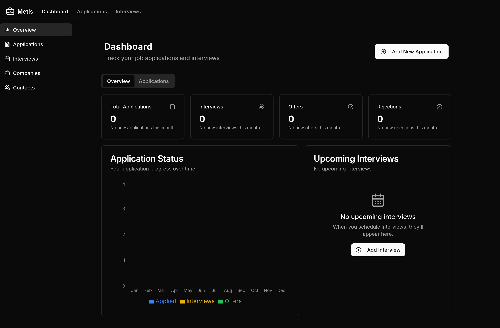

# Metis

Metis is a dashboard application to manage and monitor your job applications. It allows you to track your job applications, manage your interviews, and keep notes on each application.

## Features
- Track job applications with details like company name, position, status, and date applied.
- Manage interviews with details like date, time, and location.
- Keep notes on each application and interview.
- Filter and sort applications by various criteria.
- Responsive design for mobile and desktop use.
- Keep track of your job search progress with visualizations.

## Author

This project was created by [KwikKill](https://github.com/KwikKill) as a personal project to learn and practice React. This project is open-source.
